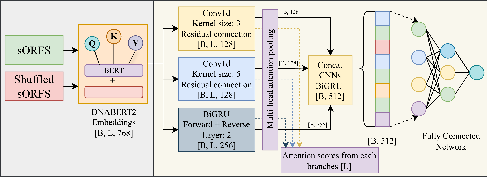
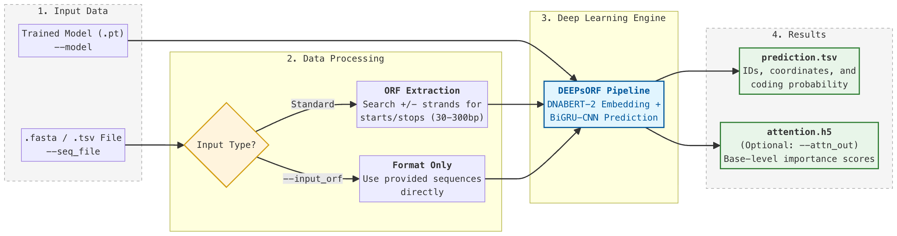

# DEEPsORF: A deep learning framework for small-open reading frames prediction



## File structures

```
DEEPsORF/
├── model/                     
│   ├── DEEPsORF.pt             # Pretrained model weights
├── py/ 
│   ├── optimize.py             # Hyperparameter optimization using 5-fold cross validation
│   ├── train.py                # Training script after hyperparameters optimization using optimize.py
│   ├── test.py                 # Testing model performance on held out set after train.py
│   ├── models.py               # Model architecture definitions
│   ├── dataset.py              # Dataset handling and preprocessing
│   ├── config.py               # Configuration parameters
│   ├── utils.py                # Utility functions
│   ├── metrics.py              # Evaluation metrics and plot functions 
│   └── emb_gen.py              # Embedding generation using DNABERT2
├── prediction/                 # Predictions and outputs
│   ├── demo_seq.fasta          # Demo sequences in fasta format
│   └── demo_seq.tsv            # Demo sequences in tsv format
├── predict.py                  # Prediction pipeline
│── readme.md                   # This file
└── environment.yml             # Environment file
```

## Installation
### Setup

1. **Clone the repository**
   ```bash
   git clone git@github.com:paudelsam/DEEPsORF.git
   cd DEEPsORF
   ```

2. **Create a virtual environment** (recommended)
   ```bash
   conda env create -f environment.yml
   conda activate deepsorf
   ```

## Usage

### Model training
If you are looking to retrain the entire model, please retrieve data files from Zenodo. Additionally, you might need to set correct file paths in `config.py` file. The following files are relevant during training.
1. emb_gen.py: You need to generate embeddings before training
2. optimize.py: Optimize hyperparamters. Include 5-fold cross-validation script
3. train.py: Train on complete data after you are satisfied with optimization
4. test.py: Test the model performance on heldout set.


### Making Predictions


```bash
python predict.py --model <path> --seq_file <path> [options]
```

### Required arguments

| Argument | Description |
|----------|-------------|
| `--model` | Path to the trained model file |
| `--seq_file` | Path to input sequence file (`.fasta` or `.tsv`) |

### Optional arguments

| Argument | Default | Description |
|----------|---------|-------------|
| `--batch_size` | `8` | Number of sequences to process per batch |
| `--output` | `.` | Directory path for output files |
| `--input_orf` | `False` | Treat input sequences as ORFs, skipping ORF prediction |
| `--attn_out` | `False` | Write attention scores to output |

### Examples

**Basic prediction from a FASTA file:**
```bash
python predict.py --model models/my_model.pt --seq_file sequences.fasta
```

**Skip ORF prediction and save results to a specific directory:**
```bash
python predict.py --model models/my_model.pt --seq_file orfs.fasta --input_orf --output results/
```

**Run with a larger batch size and output attention scores:**
```bash
python predict.py --model models/my_model.pt --seq_file sequences.tsv --batch_size 32 --attn_out --output results/
```

## Citation

If you DEEPsORF in your research, please cite:

```bibtex
[XXX Citation XXX]
```

## License
This project is free to use, modify, and distribute for any purpose, provided that appropriate credit is given to the original authors. Please cite this work in any publications, software, or derivative projects that make use of it.

## AI use statement
Some portions of this project's content, including documentation and code comments (and this statement :grinning:) may have been drafted or refined with the assistance of large language models. All AI-generated content underwent final review and revision by the authors. The authors take full responsibility for the accuracy of the information presented, the validity of cited sources, and the integrity of the work as a whole.

---

**Last Updated**: March 27, 2026 
**Version**: 1.0.0
